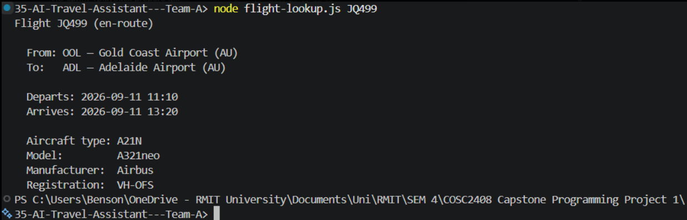
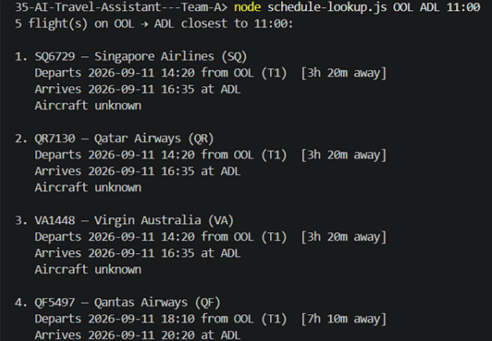
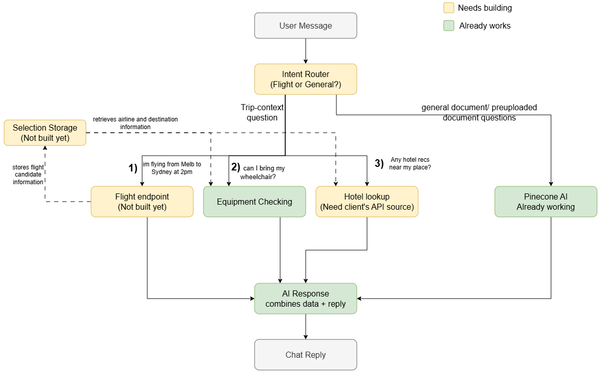

# Schema Stress-Test Findings: AI Travel Assistant

Sprint 1 Week 3 BA task: Stress-test data schema against edge cases

Prepared by: Wen Bin Liang (BA)

## 1. Purpose & Method

This document checks the finalised 16-criterion Acceptance Criteria document against the client's real, unmodified backend schema (Postgres, as reviewed in Khanh's Tech Stack & Schema document). For each AC, the question asked is: if this scenario happens, does an existing table or column represent it, or is something missing?

Three items already identified as stale or out of scope have been flagged separately to the PM and are not repeated here: the “unmatched aircraft type” and “unrecognised external-service link” checklist items (no longer applicable), and the task description's reference to “Firestore” (the actual system is Postgres).

## 2. Findings by Acceptance Criterion

| ACs         | What it needs                                                                                       | Checked against                                                                                                                                            | Result                            | Notes                                                                                                                                                                                                                                                                                                                                                                                          |
| ----------- | --------------------------------------------------------------------------------------------------- | ---------------------------------------------------------------------------------------------------------------------------------------------------------- | --------------------------------- | ---------------------------------------------------------------------------------------------------------------------------------------------------------------------------------------------------------------------------------------------------------------------------------------------------------------------------------------------------------------------------------------------- |
| AC-1        | Route/destination shown after a valid flight number                                                 | Client backend has no flight-lookup endpoint or flight table; data comes live from Airlabs, nothing persisted                                              | Pass                              | No storage needed as this AC doesn't require anything to be saved, just displayed.                                                                                                                                                                                                                                                                                                             |
| AC-2        | Candidate flight list shown from a destination + time                                               | Same as above. Airlabs returns the list live                                                                                                               | Pass                              | No storage needed for the initial list itself.                                                                                                                                                                                                                                                                                                                                                 |
| AC-3        | System remembers which candidate list was shown, resolves the user's selection against it           | No table anywhere for a flight, trip, or session, or query, or conversation state                                                                          | Gap                               | There is nothing to store or recall “the list I just showed this user” or “which one they picked.”                                                                                                                                                                                                                                                                                             |
| AC-4        | Same as AC-3, but narrowing an existing list further                                                | Same tables checked as AC-3                                                                                                                                | Gap                               | Same missing state as AC-3, can't narrow a list that was never stored in the first place.                                                                                                                                                                                                                                                                                                      |
| AC-5        | Loading indicator while data is retrieved                                                           | N/A. purely a UI/response-timing behaviour                                                                                                                 | Pass                              | No schema involvement at all.                                                                                                                                                                                                                                                                                                                                                                  |
| AC-6        | Compatibility check using the user's equipment and the operating airline's rules                    | user_equipment, airline_equipment_rules, airline_equipment_battery_rules chain                                                                             | Pass                              | Data fully supports this                                                                                                                                                                                                                                                                                                                                                                       |
| AC-6 (new)  | Matching the airline returned by Airlabs to an airline_id already known in YAF's own airlines table | airlines table in the repo's seed data (one placeholder row). But confirmed with Dev that the client's real production database is separate and populated. | Unverifiable (not yet accessible) | If Airlabs returns an airline YAF hasn't onboarded, there's no defined behaviour for that mismatch. We assume the real production airlines table is properly populated, since the client's live app performs this exact wheelchair check successfully across real airlines but we've only had access to the local dev/seed version of the schema, which is placeholder data, not the real one. |
| AC-7        | Multiple equipment items on one profile, disambiguation before checking                             | user_equipment, no unique constraint limiting a user to one row                                                                                            | Pass                              | Schema already supports multiple registered items per user without changes.                                                                                                                                                                                                                                                                                                                    |
| AC-8 / AC-9 | Hotel and additional-service suggestions shown                                                      | No hotel/transfer/excursion tables anywhere in schema                                                                                                      | Pass                              | Expected. These are external, live-fetched suggestions with nothing to persist, consistent with how flights are handled too.                                                                                                                                                                                                                                                                   |
| AC-10       | Full happy path across multiple turns in one conversation                                           | Same missing state as AC-3/AC-4                                                                                                                            | Gap (inherited)                   | This AC can't be satisfied until the flight/candidate-selection state gap above is resolved, not a separate issue, just inherits it.                                                                                                                                                                                                                                                           |
| AC-11       | A concrete “not compatible” outcome,                                                                | battery_types table exists                                                                                                                                 | Pass                              | "Confirmed via seed.sql: the 4 battery_types are lithiumIon, nonSpillableNickelDry, nonSpillableWet, and spillable ('with liquid electrolyte' in the Romanian translation).                                                                                                                                                                                                                    |
| AC-12       | Invalid/unrecognized flight number handled gracefully                                               | N/A. handled directly by the Airlabs response, nothing to persist                                                                                          | Pass                              | Matches Ryan's wireframe already; no schema change needed.                                                                                                                                                                                                                                                                                                                                     |
| AC-13       | No matching flights for a natural-language description                                              | N/A. same as above                                                                                                                                         | Pass                              | No schema involvement.                                                                                                                                                                                                                                                                                                                                                                         |
| AC-14       | No equipment profile registered                                                                     | user_equipment. absence of rows is a normal, already-handled case                                                                                          | Pass                              | An empty result set is not a schema problem; already works today.                                                                                                                                                                                                                                                                                                                              |
| AC-15       | No additional service available (optional)                                                          | N/A. external, nothing to persist                                                                                                                          | Pass                              | No schema involvement.                                                                                                                                                                                                                                                                                                                                                                         |
| AC-16       | API failure or timeout handled gracefully                                                           | N/A. no persisted state implied by this AC                                                                                                                 | Pass                              | No schema involvement, assuming no failure-logging table is required (not currently scoped).                                                                                                                                                                                                                                                                                                   |

## 2b. Hands-On Verification, Candidate-Flight Lookup (Destination + Time)

To directly verify AC-2 and check for partial/missing API responses, I ran the team's flight-lookup.js and schedule-lookup.js PoC scripts myself against live Airlabs data, rather than relying only on Khanh's earlier results.

Single-flight lookup (flight-lookup.js). Tested a currently-airborne flight (JQ499, Jetstar) that I found on Flightradar24, confirmed a complete response including aircraft type (A321neo), matching Flightradar24 exactly.

Candidate-list lookup (schedule-lookup.js). Tested OOL→ADL, aircraft type came back "unknown" every time, even for JQ497 — the same airline as the airborne flight above, on the same day.

Finding: the candidate-list endpoint does not return aircraft type, regardless of airline. This does not block any AC, aircraft type is display-only; the compatibility check itself is airline-based, not aircraft-based (see AC-6). Flagged so Dev knows not to rely on this field being populated at the candidate-list stage.

We suspect this is because Airlabs only populates aircraft type for flights that are actively airborne (confirmed separately via flight-lookup.js, a landed and a not-yet-departed flight both came back "unknown," while an airborne one returned it correctly). Since /schedules only ever returns upcoming, not-yet-departed flights, it may simply never have the chance to show aircraft type in the first place

## 3. Summary of Real Gaps Found

### Gap 1: No table for tracking a flight search or selection (AC-3, AC-4, AC-10)

The schema has no table for a flight, a trip, or a conversation/session. Flight data is fetched live from Airlabs and never stored. This means the chatbot currently has no way to remember “the list of candidate flights I just showed this user” or “which one they picked”, both of which multiple ACs depend on directly.

Suggested addition (for Dev to design, not specified here): a small table under the ai\_ prefix Khanh already flagged as free to use e.g. tracking a user's active flight-search session, the candidate list shown, and the selected flight, scoped to the user (and tenant, consistent with the schema's existing tenant_id pattern). This is a proposal to raise with Khanh, not a finalised design.

### Gap 2: Airline returned by Airlabs may not exist in YAF's own airlines table (new, AC-6)

The compatibility check depends on matching the operating airline to a row in the YAF airlines table. If Airlabs returns an airline YAF hasn't onboarded, there's currently no defined behaviour for that mismatch.

The version of this table available to us, from the repo's seed files, only contains one placeholder airline, which initially looked like a real gap. However, the client's real production database is confirmed to exist separately (their live app performs this exact wheelchair check successfully across real airlines), and the team doesn't yet have access to it.

## 4. What Doesn't Need Any Change

AC-1, AC-2, AC-5, AC-7, AC-8, AC-9, AC-12, AC-13, AC-14, AC-15, and AC-16 are all already supported by the existing schema, or don't involve persisted data at all (loading states, live external lookups, and error messaging). No changes needed for these.

## 5. Sprint 2 Architecture Overview

While going through the client's repo for the stress-test above, a bigger picture started forming of how the whole chatbot flow might connect end to end, beyond just the schema. This isn't a finalised design, just a rough sketch of what already works, what's missing, and how the pieces plug into each other, based on everything found across the schema, ERD, and module docs. Shared here for context.

**User Message**: the passenger's raw input to the chatbot. Could be a flight number, a destination and time, a question about equipment, a request for a hotel, or something entirely unrelated to any of this (e.g. a general policy question).

**Intent Router (not built yet)**: right now, every single message the chatbot receives gets sent straight to Pinecone, no matter what it says. So if someone types "flight from SYD to MEL around 11am," Pinecone would try to answer it like a general document question, it has no way to recognize this is actually a flight search. The Intent Router is the missing piece that reads the message first and decides which path it should go down: a general question, a flight question, an equipment question, or a hotel question, before anything else happens.

This isn't something the client explicitly asked for, but it's a real gap and confirmed directly from the repo, no such check exists anywhere today. Mechanism-wise, still unsure, could be simple keyword matching, a small classification step, or an upfront LLM call (open for Dev).

**Pinecone AI (already working)**: The existing chatbot path from client's repo. It answers general questions by matching them against a fixed set of documents someone uploaded beforehand, accessibility policies, FAQs, that kind of thing. It's explicit about its own limits: it refuses anything outside that uploaded set. This path has nothing to do with the user's specific trip.

**Flight endpoint (not built yet)**: handles finding or identifying a specific flight, whether the user typed a flight number directly or described a destination and time. Neither currently exists in the backend; Airlabs is wired in for airport departures/arrivals only, not flight-number lookup or route-specific candidate search.

**Selection Storage (not built yet)**. For remembering the flight, operating airline, and destination once the flight endpoint has identified them. This is what lets equipment checking and hotel lookup work later, in a separate message, without the user needing to repeat themselves. Confirmed directly from the client's own architecture documentation: "the backend treats each chat request as standalone". There is currently no memory of any kind between messages, so this piece is missing in its entirety, not just partially built.

**Equipment Checking (already working)**. It reads the operating airline back out of Selection Storage, then checks the user's registered equipment against that airline's rules. This is fully built and tested in the client's backend already: POST /equipment/{airlineId}/verify, keyed to airline and equipment type, returning one of three outcomes (eligible, not eligible, or eligible with a caution note), not simply a yes/no. It is scoped to the airline's policy, not the specific aircraft; there is no aircraft table anywhere in the schema.

**Hotel lookup (blocked on client)**. Reads the destination back out of Selection Storage, then looks up accessible accommodation nearby. there is no hotel provider named, no API access, and no trace of any hotel integration anywhere in the client's repository. The client has confirmed they have their own accessible-hotel data source, but never provided its name or access to it.

**AI Response**. Takes whatever came back from the flight endpoint, equipment checking, or hotel lookup, and turns it into a natural-language reply.

**Chat Reply**. The finished, phrased message the user actually sees in the chat window.
